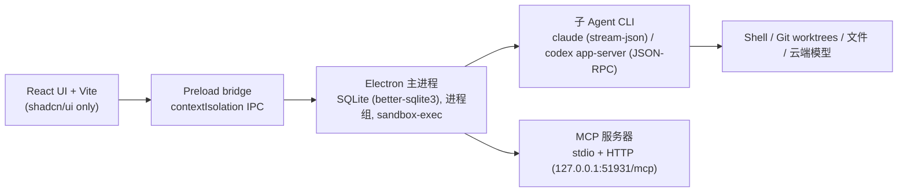

# OctoPunk (newApp — Electron + React + shadcn/ui)

[](./LICENSE)


One-to-one migration of the native SwiftUI macOS app **OctoPunk** (`../OctoPunk`) onto the
Codex-desktop-style architecture:



OctoPunk is a Git task control plane for a Codex-led Agent Team:

- Codex connects through MCP and remains the primary agent and reviewer.
- OctoPunk owns scheduling, SQLite state, idempotency, audit events, and external child-agent
  lifecycles.
- Each delegated task explicitly selects `claude_code` or `codex` and `read_only` or
  `workspace_write`.
- Claude Code and Codex use their native CLI login state. OctoPunk never stores model API keys.

All behavior is ported one-to-one from the Swift sources (same SQL schema, same state machine,
same redaction/audit/policy rules, same MCP tool surface).

**[📖 使用文档（中文）](./docs/USAGE.md)** — 安装启动、界面导览、设置说明、MCP 接入、FAQ。

## Requirements

- macOS 14+, Node 24, an authenticated local `claude` CLI and/or Codex CLI
- A local Git repository to work in

## Layout

| Swift source | TypeScript port |
| --- | --- |
| `App/OctoPunkApp.swift` | `electron/main.ts` (`--mcp-stdio` or GUI window 1280×820, min 1080×720) |
| `App/AppState.swift` | `src/appState.tsx` (React context over the preload bridge) |
| `App/AppEnvironment.swift` | `electron/appEnvironment.ts` (composition root) |
| `Domain/Models/TeamModels.swift` | `electron/domain/models.ts` |
| `Domain/Events/TeamEvents.swift` | `electron/domain/events.ts` (TaskEventHub, stable JSON codec) |
| `Domain/Policies/TeamRunPolicy.swift` | `electron/domain/policy.ts` |
| `Domain/Repositories/TeamRunRepository.swift` | `electron/domain/repositoryPort.ts` |
| `Application/DTOs/TeamDTOs.swift` | `shared/dtos.ts` + `electron/application/dtos.ts` |
| `Application/Ports/AgentPorts.swift` | `electron/application/ports.ts` |
| `Application/Ports/AgentTeamServicePort.swift` | `electron/mcp/serviceTypes.ts` |
| `Application/Services/AgentTeamApplicationService.swift` | `electron/application/agentTeamService.ts` |
| `Application/Services/ChildExecutionService.swift` | `electron/application/childExecutionService.ts` |
| `Application/Services/TeamQueryService.swift` | `electron/application/teamQueryService.ts` |
| `Application/Services/TaskIntegrationService.swift` | `electron/application/taskIntegrationService.ts` |
| `Application/Services/ContextFetchService.swift` | `electron/application/contextFetchService.ts` |
| `Data/Persistence/Database/*` | `electron/data/database.ts` (migrator v1–v6, WAL, same DDL) |
| `Data/Persistence/Migration/LegacySessionImporter.swift` | `electron/data/legacySessionImporter.ts` |
| `Data/Repositories/GRDBTeamRunRepository.swift` | `electron/data/repository.ts` (better-sqlite3; ValueObservation → explicit write-notification observers) |
| `Platform/Process/LocalProcessAdapter.swift` | `electron/platform/processAdapter.ts` (detached process groups, `sandbox-exec`, environment allow-list) |
| `Platform/Git/GitAdapter.swift` | `electron/platform/gitAdapter.ts` |
| `Platform/Claude/ClaudeCLIAdapter.swift` | `electron/platform/claudeCliAdapter.ts` |
| `Platform/Claude/CodexAppServerAdapter.swift` | `electron/platform/codexAppServerAdapter.ts` (+ `ChildAgentRegistry`) |
| `Platform/MCP/OctoPunkMCPServer.swift` | `electron/mcp/server.ts` (`@modelcontextprotocol/sdk`) |
| `Platform/MCP/OctoPunkHTTPApplication.swift` | `electron/mcp/httpApplication.ts` (node:http stateful bridge) |
| `Platform/Keychain/KeychainTokenStore.swift` | `electron/platform/keychainTokenStore.ts` (Electron `safeStorage`) |
| `Platform/MCP/CodexConfigAdapter.swift` | `electron/platform/codexConfigAdapter.ts` (`~/.codex/config.toml`) |
| `Platform/LoginItem/LoginItemAdapter.swift` | `electron/platform/loginItemAdapter.ts` (`setLoginItemSettings`) |
| `Platform/Notifications/NotificationAdapter.swift` | `electron/platform/notificationAdapter.ts` |
| `Features/TeamDashboard/TeamDashboardView.swift` | `src/features/dashboard/TeamDashboardView.tsx` |
| `Features/RunDetail/RunDetailView.swift` | `src/features/runDetail/RunDetailView.tsx` |
| `Features/Settings/SettingsView.swift` | `src/features/settings/SettingsView.tsx` |
| `Features/Onboarding/OnboardingView.swift` | `src/features/onboarding/OnboardingView.tsx` |
| `Features/Shared/DesignTokens.swift` | Tailwind/shadcn design tokens in `src/index.css` |

The renderer uses **shadcn/ui exclusively** for every component and layout: `sidebar` (the
NavigationSplitView), `resizable` (the HSplitView task list/detail), `card`, `dialog`,
`alert-dialog`, `select`, `checkbox`, `switch`, `textarea`, `badge`, `tooltip`, `scroll-area`,
`skeleton`, `separator`, `progress` — no hand-rolled widgets.

## Data locations (identical to the Swift app)

- Database: `~/Library/Application Support/OctoPunk/octopunk.sqlite` (first launch copies a
  legacy `RelayDesk/relaydesk.sqlite` forward, including `-wal`/`-shm`)
- Worktrees: `~/Library/Application Support/OctoPunk/worktrees/<runID>/…`
- Integration worktree: `~/Library/Application Support/OctoPunk/integration/<runID>`
- Legacy session import: `~/Library/Application Support/{OctoPunk,RelayDesk}/last-session.json`
- Settings (replaces `@AppStorage`/`UserDefaults`):
  `~/Library/Application Support/OctoPunk/settings.json`
- MCP HTTP bearer token: Electron `safeStorage` (Keychain), state file in the support directory

## MCP

Default transport is **local STDIO**. **Settings → Connect Codex** writes a command-based
`[mcp_servers.octopunk]` entry into `~/.codex/config.toml` that launches this app with
`--mcp-stdio`. The optional HTTP compatibility endpoint is `http://127.0.0.1:51931/mcp`
(loopback, bearer-authenticated, started explicitly from Settings).

A running sub-agent additionally receives a task-bound restricted STDIO MCP server exposing
exactly two read-only tools (`get_team_context`, `get_task_report`), bound by
`OCTOPUNK_SESSION_RUN_ID` / `OCTOPUNK_SESSION_TASK_ID` — identical to the Swift implementation.

v0.4 adds the review surface on the same control plane: `get_task_diff`,
`add_review_comments`, `request_rework_batch` (line-anchored review comments aggregated into
rework), `set_gate_config` / `run_quality_gate` / `waive_gate_item` (project-default quality
gates with per-item pass/fail/waived/unknown results enforced before `accept_task`),
`run_review` / `get_arbitration` (cross-model review modes with consensus / disagreement /
to-verify arbitration), and optional `create_pr` / `get_pr_status` (GitHub feedback via the
local `gh` CLI, off by default, no tokens stored).

## Development

Package manager: **pnpm** (11+). pnpm blocks dependency build scripts by default; the project
ships a `pnpm-workspace.yaml` that allows `electron`, `esbuild`, and `@electron/rebuild`, and
deliberately disables `better-sqlite3`'s own prebuild (it installs a Node-ABI binary that would
clobber the Electron rebuild). The root `postinstall` runs `electron-rebuild` so better-sqlite3
always ends up on the Electron ABI.

```bash
pnpm install         # downloads Electron + builds better-sqlite3 for Electron
pnpm run typecheck   # main process + renderer
pnpm run build       # tsc → dist-electron, vite → dist
pnpm run dev         # vite dev server + electron with live reload
pnpm start           # run the built app
./tools/package-app.sh   # offline packaging → release/OctoPunk.app (ad-hoc signed)
```

Packaging needs no electron-builder: the script esbuild-bundles the main
process (MCP SDK inlined, better-sqlite3 external), copies the local Electron
runtime, renames bundle + helpers, and ad-hoc codesigns the result.

Tests (ported from `OctoPunkTests`) need better-sqlite3 on the plain-Node ABI:

```bash
cd node_modules/.pnpm/better-sqlite3@*/node_modules/better-sqlite3 && rm -rf build/Release && npx prebuild-install && cd -
pnpm test
pnpm exec electron-rebuild -f -w better-sqlite3   # restore the Electron ABI before running the app
```

`OCTOPUNK_DATABASE_URL=<path>` overrides the database location (diagnostics/CI) without touching
the live support directory.

## Step-by-step MCP trace tool

`tools/mcp-trace.mjs` drives the real app over MCP stdio and prints every execution step with
elapsed-time stamps: each tool call, each live `notifications/octopunk/task_event`, each task
state transition, and each audit event as it lands.

```bash
pnpm mcp:trace                                # throwaway repo + DB, 1 read-only claude task, full lifecycle
pnpm mcp:trace --repo /path/to/repo           # drive a real repository
pnpm mcp:trace --db real                      # use the live DB (run appears in the GUI sidebar)
pnpm mcp:trace --tasks 4                      # 3 run concurrently, the 4th queues
pnpm mcp:trace --agent codex --mode workspace_write
pnpm mcp:trace --no-accept                    # stop after the report, before review
pnpm mcp:trace --keep                         # keep worktrees for inspection
pnpm mcp:trace --verbose --list-only          # protocol dump of initialize + tools/list
```

Other flags: `--title`/`--prompt`, `--poll-ms`, `--max-wait-secs`, `--join-secs`, `--cleanup auto|always|never` (auto: discard on throwaway DBs, keep on the live DB). Temp repo/DB are
removed automatically; completed runs are retained by design.


## Workflow (unchanged)

1. Codex calls `start_team`; the run baseline is fixed to `HEAD` and the target branch recorded.
2. Codex calls `delegate_tasks` with a redacted parent context summary and an ordered list of
   explicit `agent_kind` / `execution_mode` tasks (`delegate_task` is the single-task wrapper).
3. The batch is validated (parent tree + DAG, atomic, idempotent by `client_key`/`request_id`);
   up to three children run at once, the rest queue.
4. Read-only tasks share a detached baseline worktree; write tasks get a private branch/worktree.
5. Codex receives `notifications/octopunk/task_event` and can `join_tasks` (45s cap, partial
   state, deterministic Markdown summary); `get_task_execution_log` is the incremental fallback.
6. `PASS` integrates write tasks; `REWORK` resumes the same native session with findings and the
   immutable context snapshot.
7. `complete_team` with final `PASS` applies the integration result to the recorded target
   branch (refusing if it moved or is dirty) before cleanup.

Blocked/cancelled worktrees are retained for `resume_task`; `discard_task` / `discard_team`
remove them explicitly. The sidebar keeps completed runs forever; terminal non-completed runs
can be hidden (soft delete, audit record retained).

## Current MVP boundary

One active run at a time, configurable concurrency (1–10 children at once, default 3 —
Settings → 常规 → 并发限制), durable queueing, SQLite as the durable system of record, MCP as
the northbound adapter, every execution recorded as an attempt and every report retained for
review.

## License

Released under the [MIT License](./LICENSE).
